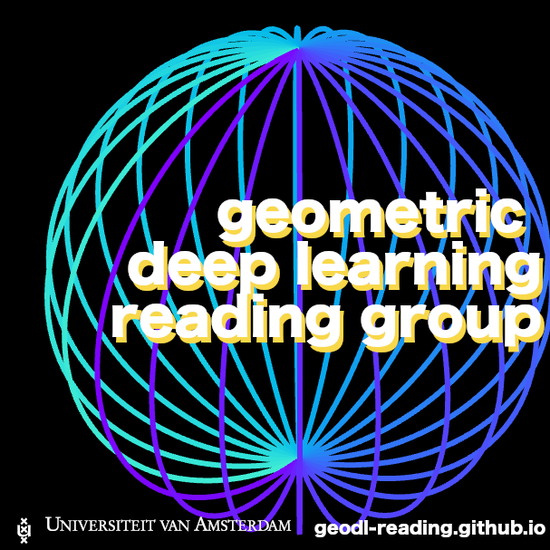

#  Geometric Deep Learning Seminar

 
A seminar group for everyone interested in geometric deep learning, hosted by [Video & Image Sense Lab](https://ivi.fnwi.uva.nl/vislab/) and [Amsterdam Machine Learning Lab](https://amlab.science.uva.nl/). In principle, held bi-weekly (we mean the 'once every two weeks' one).

Below, we will publish Zoom links for those who would like to attend the sessions online.

# schedule

| Date | Location | Time | Speaker | Topic | Zoom | Recording |
| --- | --- | --- |  --- |  --- | --- | --- | 
| 14 Oct '22 | C4.174 | 16:00 CET | [Leo Dorst](https://staff.fnwi.uva.nl/l.dorst/) | [Plane Based Geometric Algebra](https://bivector.net/) | [Zoom](https://uva-live.zoom.us/j/87113909900) | [Youtube](https://www.youtube.com/watch?v=8n6GsKWznfY&ab_channel=UvA-GeoDL) |
| 28 Oct '22 | - | - | - | ECCV, no meeting scheduled | - | - |
| 11 Nov '22 | C4.174 | 16:00 CET | [Andy Keller](http://www.keller.org/about/) | [Topographic VAEs Learn Equivariant Capsules](https://arxiv.org/abs/2109.01394) | [Zoom](https://uva-live.zoom.us/j/86185392027) | [Youtube](https://www.youtube.com/watch?v=57yE8qapp9A) |
| 25 Nov '22 | L3.35 | 16:00 CET | [Sharvaree Vadgama](https://twitter.com/sharvvadgama) | [Kendall Shape-VAE Learning Shapes in a Generative Framework](https://openreview.net/pdf?id=nzh4N6kdl2G) | [Zoom](https://uva-live.zoom.us/j/89309489220) | - |
| 9 Dec '22 | - | - | - | NeurIPS, no meeting scheduled | - | - |
| 16 Dec '22 | C4.174 | 16:00 CET | [Artem Moskalev](https://amoskalev.github.io/) | [LieGG: Studying Learned Lie Group Generators](https://arxiv.org/abs/2210.04345) | [Zoom](https://uva-live.zoom.us/j/85330383307) | - |
| 23 Dec '22 | - | - | - | x-mas time, no meeting scheduled | - | - |
| 6 Jan '23 | L3.35 | 16:00 CET | - | to be determined | - | - |
| 20 Jan '23 | L3.35 | 16:00 CET | [Ivan Sosnovik](https://isosnovik.xyz/) | [DISCO: accurate Discrete Scale Convolutions](https://arxiv.org/abs/2106.02733) | - | - |

## contact

Have a topic you would like to talk about on the reading group? Or just want to chat? Reach out to us on twitter:
- [David Wessels](https://mobile.twitter.com/dafidofff), AI Research Engineer at [Ellogon.ai](https://ellogon.ai/).
- [David Knigge](https://twitter.com/davidmknigge), PhD student with dr. Efstratios Gavves at the [Video & Image Sense Lab](https://ivi.fnwi.uva.nl/vislab/).
- [Putri van der Linden](https://twitter.com/compute_ri), PhD student with dr. Erik Bekkers at the [Amsterdam Machine Learning Lab](https://amlab.science.uva.nl/).
